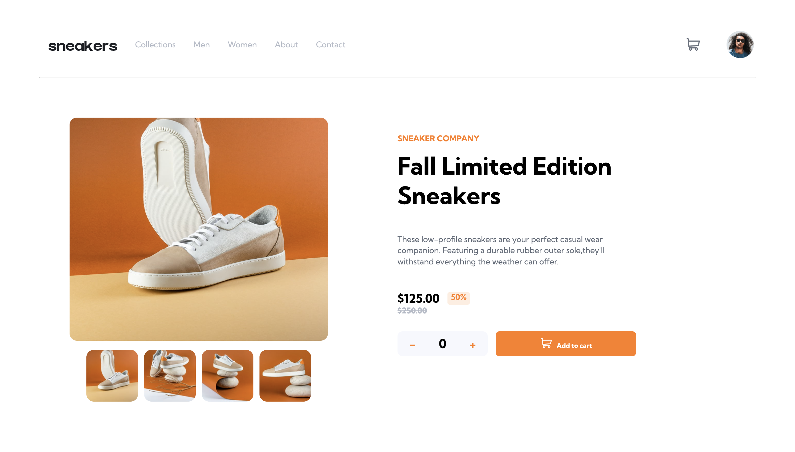

# Frontend Mentor - E-commerce product page solution

This is a solution to the [E-commerce product page challenge on Frontend Mentor](https://www.frontendmentor.io/challenges/ecommerce-product-page-UPsZ9MJp6). Frontend Mentor challenges help you improve your coding skills by building realistic projects.

## Table of contents
  - [Screenshot](#screenshot)
  - [Links](#links)
  - [Built with](#built-with)
  - [What I learned](#what-i-learned)
  - [Continued development](#continued-development)
- [Acknowledgments](#acknowledgments)

### Screenshot

### Links

- Solution URL: [Add solution URL here](https://your-solution-url.com)
- Live Site URL: [Add live site URL here](https://your-live-site-url.com)

### Built with

- Semantic HTML5 markup
- CSS custom properties
- Flexbox
- CSS Grid
- Javascript

### What I learned

This project I learned more about responsive design where I used a lot more flexbox to make my webpage look good in almost any size.
I also learned about adding items to a cart. I have been watching a udemy course and I actually got to use some strategies from there that were useful.

### Continued development

I still want to work on my responsive design and best practice when it comes sto refactoring code. This includes mostly CSS and Javascript. Making reusable code has been something ive really wanted to do but have failed. I will definitely look up more videos on how to make reusable code to improve my skills. 

## Acknowledgments

If anyone is reading this I would like to say to just go for it. I thought this project was way out of my league when I first started it. I had only been coding for 3 months when I started this and I doubted myself alot. But im here and im  proud of this. Even though its not perfect its something that was definitely very challenging
